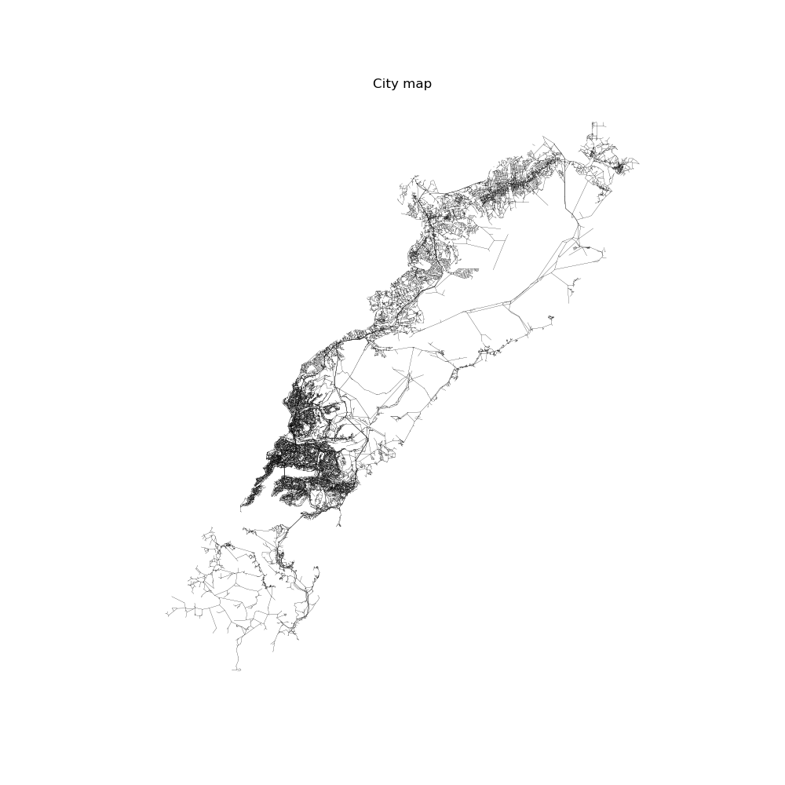
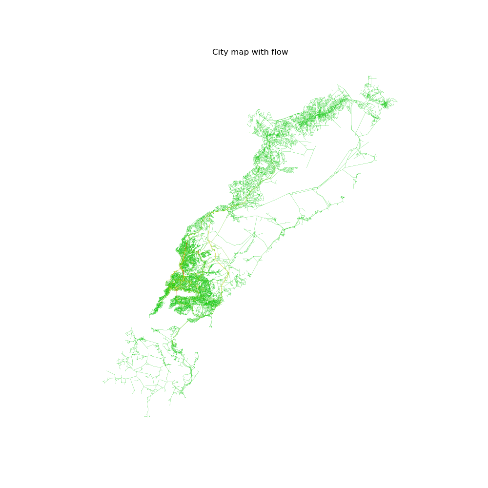
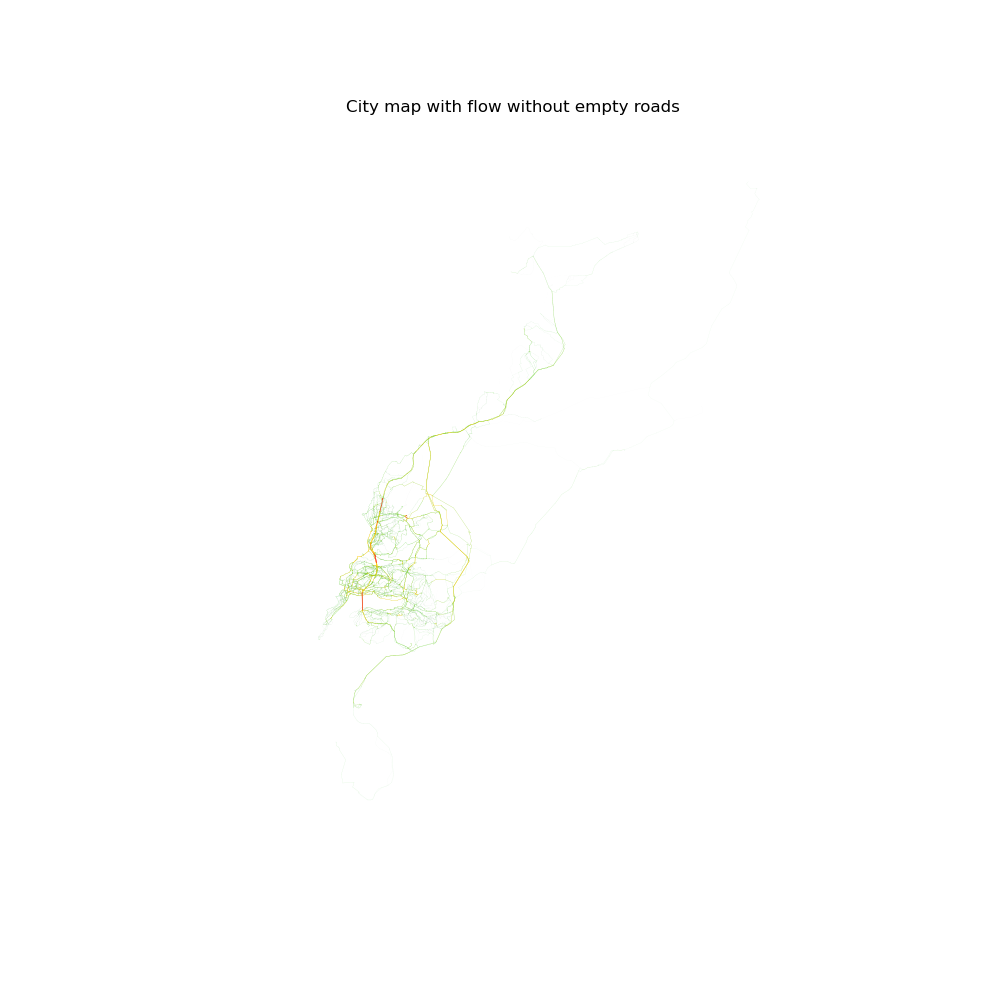
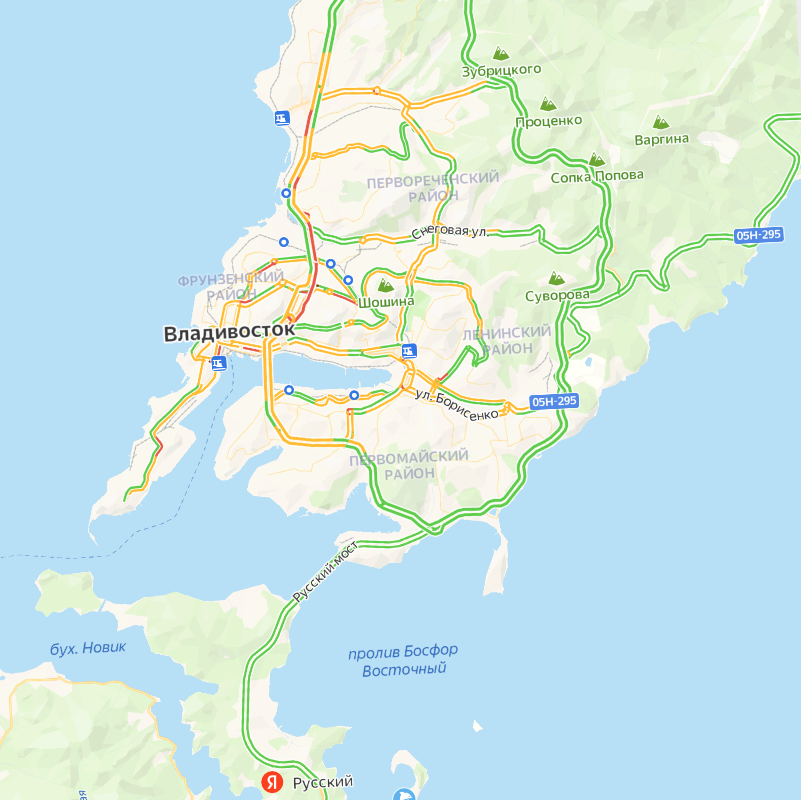

# Stable Dynamic & Beckmann models

The project is a fork of [this repository](https://github.com/tamamolis/TransportNet/tree/vladi).

The main code is in `main.ipynb`

Main developments: added warm start for Sinkhorn and made flow visualization for Vladivostok data

     
     

     
     

